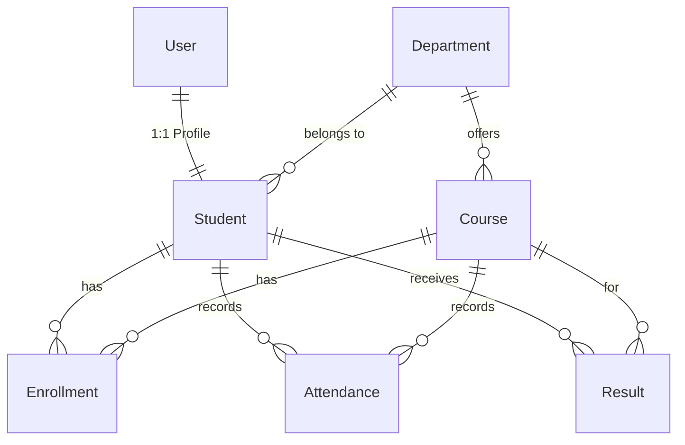

# 🎓 Student Management System (SMS)

[](https://www.djangoproject.com/)
[](https://www.python.org/)
[](https://www.django-rest-framework.org/)
[-orange?style=for-the-badge&logo=json-web-tokens&logoColor=white)](https://django-rest-framework-simplejwt.readthedocs.io/)
[](https://www.sqlite.org/)
[](https://getbootstrap.com/)

A enterprise-grade, full-stack **Student Management System** designed to streamline academic operations. The application is built on Python's robust **Django 4.2 LTS** framework, utilizing **Django REST Framework (DRF)** for headless API capabilities secured via **JSON Web Tokens (JWT)**. It features a responsive, polished portal for students and administrators styled with **Bootstrap 5**.

---

## ⚡ Core Features

*   **🔒 Multi-Channel Authentication**: Hybrid authentication featuring standard Django session logins for the Web Portal and SimpleJWT tokens for external REST client integration.
*   **👥 Student Profiles**: Full CRUD operations on student records including profile picture uploads, unique roll numbers, year classifications, and automatic contact records.
*   **📚 Course & Enrollments**: Dynamic course listings categorized by department, allowing students to enroll in courses with database-level uniqueness constraints.
*   **📊 Attendance Tracking**: Efficient dashboard interfaces for administrators to mark daily attendance (Present, Absent, Late) and for students to view their real-time attendance percentage metrics.
*   **📝 Results & Automated Grading**: Automatic GPA/grade allocation (`A+`, `A`, `B+`, `B`, etc.) computed on database write operations by overriding ORM save cycles.
*   **🔌 Headless REST API**: Fully functional endpoints for programmatic operations (students, courses, attendance, grades) with filter queries.
*   **🌱 Auto-Seeding Command**: Single-command data population using random seeding libraries to instantiate reference records, test profiles, and transaction items.

---

## 📐 System Architecture & Database Schema

The database relies on relational integrity constraints mapped out in custom models across five decoupled apps: `accounts`, `students`, `courses`, `attendance`, and `results`.



### Decoupled Directory Structure
```
student_management_system/
├── sms/                  → Main settings, security configurations, and root URLs
├── accounts/             → Session authentication routing, login/register forms, and primary portal dashboards
├── students/             → Student profiling, department directory schemas, and admin controllers
├── courses/              → Course catalogs and junction-level enrollment tables
├── attendance/           → Attendance transaction records (daily registers)
├── results/              → Academic test records and calculation rules
├── api/                  → DRF serializers, viewsets, and JWT token controllers
├── templates/            → Modular HTML structures built with Bootstrap 5 components
├── static/               → Production assets (vanilla CSS styles, UI JS utilities, brand images)
└── manage.py             → Command-line utility for administrative tasks
```

---

## ⚙️ Quick Setup (Windows Environment)

Follow these steps to run the application locally on Windows:

### 1. Prerequisite Installations
Ensure Python 3.10+ is installed on your local computer. Ensure the option **"Add Python to PATH"** is checked during installation.

### 2. Environment Initialization
Clone the repository and open the workspace in VS Code, then launch a terminal and execute:
```powershell
# Initialize virtual environment
python -m venv venv

# Activate virtual environment
venv\Scripts\activate

# Install application dependencies
pip install -r requirements.txt
```

### 3. Database Deployment & Seeding
Execute database migrations and populate sample developer records:
```powershell
# Perform database schema migrations
python manage.py migrate

# Create your primary administrator credential
python manage.py createsuperuser

# Seed the database with high-quality mock data (Departments, Students, Courses, Attendance, Grades)
python manage.py populate_data
```

### 4. Booting Up Server
Run the local development server:
```powershell
python manage.py runserver
```
Visit http://127.0.0.1:8000 in your browser to view the application. The Django Admin panel is located at http://127.0.0.1:8000/admin/.

---

## 🔑 Sample Testing Credentials

If you populated the database using `populate_data`, you can test student accounts using:

| Username | Password | Access Level |
|---|---|---|
| `admin` (or custom superuser) | *Your created password* | Admin Dashboard & Database Access |
| `student1` | `student123` | Student Portal (View Attendance & Results) |
| `student2` | `student123` | Student Portal (View Attendance & Results) |
| `student3` | `student123` | Student Portal (View Attendance & Results) |

---

## 🔌 API Documentation

All API requests (except authentication) require a bearer token in the Authorization header.

### 🔑 Authentication Flow

#### 1. Retrieve Access Token
* **Endpoint**: `POST /api/token/`
* **Body (JSON)**:
```json
{
  "username": "admin",
  "password": "yourpassword"
}
```
* **Response (JSON)**:
```json
{
  "refresh": "eyJhbGciOiJIUzI1NiIsIn...",
  "access": "eyJhbGciOiJIUzI1NiIsIn..."
}
```

#### 2. Refresh Access Token
* **Endpoint**: `POST /api/token/refresh/`
* **Body (JSON)**:
```json
{
  "refresh": "eyJhbGciOiJIUzI1NiIsIn..."
}
```

---

### 📡 Data Endpoints

Include `Authorization: Bearer <access_token>` in your request headers.

| Method | Endpoint | Query Parameters | Description |
| :---: | :--- | :--- | :--- |
| **GET** | `/api/students/` | *None* | Returns a paginated list of all student profiles. |
| **GET** | `/api/courses/` | *None* | Returns a list of all active course listings. |
| **GET** | `/api/attendance/` | `student_id` (Integer) | Returns attendance sheets. Filter using `?student_id=1`. |
| **GET** | `/api/results/` | `student_id` (Integer) | Returns grade distributions. Filter using `?student_id=1`. |

---

## 🛠️ Key Technical Implementations

Recruiters and developers, take note of these design patterns implemented within the repository:

1. **ORM N+1 Query Prevention**: Highly optimized database queries using Django's `.select_related()` and `.prefetch_related()` methods to eager-load foreign-key structures, decreasing query overhead.
2. **Encapsulated Business Logic**: Grading logic is kept dry by overriding the standard `save()` method on the `Result` model. Grades are automatically computed instantly based on marks scored.
3. **Idempotence & Bulk Execution**: The attendance engine implements `update_or_create()` queries for bulk submissions, preventing double-entry conflicts and enabling duplicate action safety.
4. **Relational Constraints**: Relational tables include custom `unique_together` parameters (e.g., student-course-date for attendance, student-course for grades) preventing data corruption.
5. **Decoupled Security Layer**: High-security token configurations implementing `rest_framework_simplejwt` with customizable token lifetimes (5-minute access, 1-day refresh).
6. **Form Level Validation**: Custom view-model forms (`forms.py`) featuring Django field overrides, regex validators for telephone profiles, and custom clean routines.
7. **Clean Modular Templates**: DRY template design with reusable template components and a primary layout wrapper (`base.html`), ensuring rapid UI modifications.
